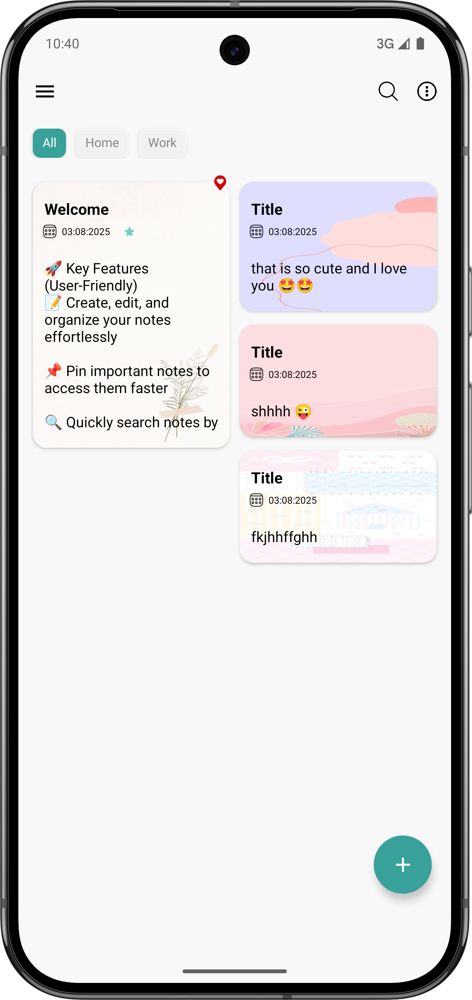
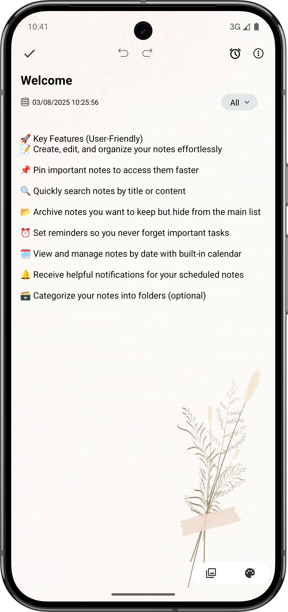
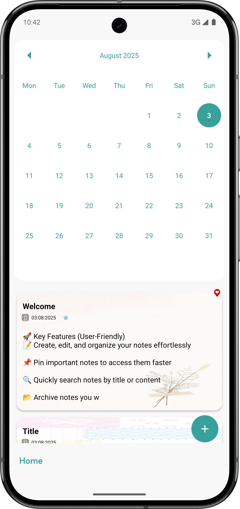
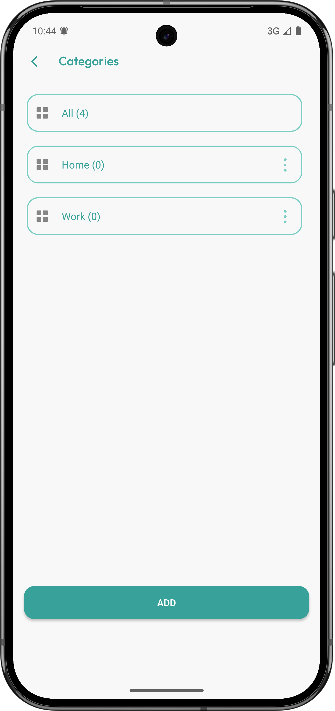
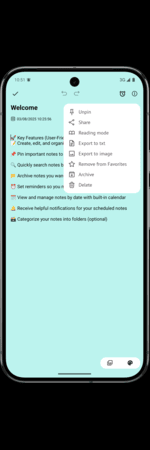
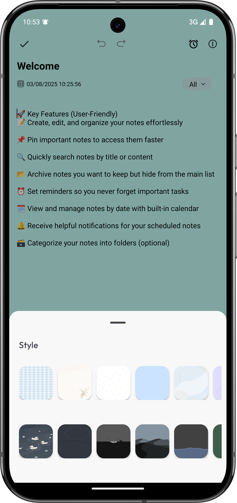
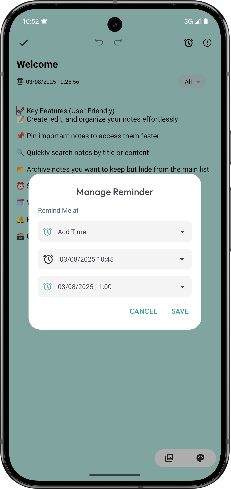
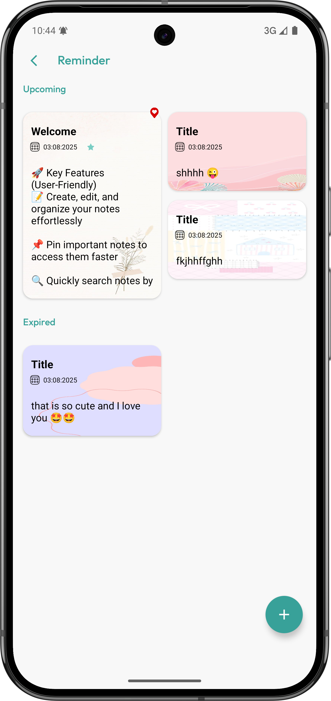

# 📝 EasyNotes - Android

Ứng dụng ghi chú đơn giản, nhẹ, được phát triển bằng Java sử dụng kiến trúc MVVM. 
Cho phép người dùng tạo, chỉnh sửa, lưu trữ và quản lý các ghi chú một cách hiệu quả.

## 📱 Giao diện
<p align="center">
  
  
  
  
  
  
  
  
</p>


## 🚀 Tính năng chính
- ✍️ Thêm, sửa, xoá ghi chú
- 📌 Ghim ghi chú quan trọng
- 🔍 Tìm kiếm ghi chú theo tiêu đề hoặc nội dung
- 📁 Lưu trữ cục bộ với Room Database
- 🗃️ Phân loại ghi chú theo thư mục (tuỳ chọn)
- ⏰ Nhắc nhở (Reminders) (tuỳ chọn)

## 🧱 Kiến trúc & Công nghệ
- **Language:** Java
- **Architecture:** MVVM (Model - View - ViewModel)
- **Database:** Room
- **UI:** XML, RecyclerView, ConstraintLayout, Material Design Components, Animation
- **LiveData & ViewModel:** Lifecycle-aware

## 🛠️ Cài đặt & chạy thử
1. Clone repo:
    ```bash
    git clone https://github.com/Hoamz123/NoteAppAndroid.git
    ```
2. Mở bằng Android Studio
3. Chạy trên máy ảo/emulator hoặc thiết bị thật (Android 5.0 trở lên)

## 🧑‍💻 Người phát triển
- 👤 [hoamz](https://github.com/Hoamz123)
- 📧 Email: hoamzdev@gmail.com

## 💡 Góp ý & Đóng góp
Mọi đóng góp đều được hoan nghênh!  
👉 Bạn có thể tạo [Issue tại đây](https://github.com/Hoamz123/NoteAppAndroid/issues)
